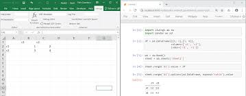

# EXCEL-AUTOMATION

A python application that processes excel spreadsheet in under a second

To use this code you have to install python on your local machine after which you install a python package called
OPENPYXL

Using the command below:

pip install openpyxl -WINDOWS

pip3 install openpyxl -MAC

Then you can automate your excel spreadsheets accurately.

## Mockups

